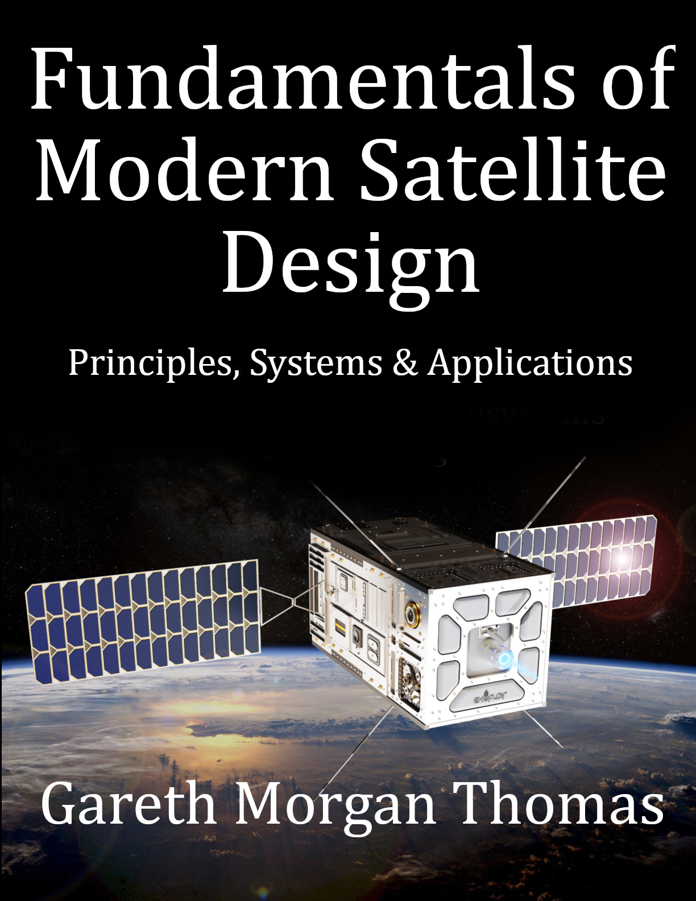

# Fundamentals Of Modern Satellite Design

### Cover

### Repository Structure
- `covers/`: Book cover images
- `blurbs/`: Promotional blurbs
- `infographics/`: Marketing visuals
- `source_code/`: Code samples
- `manuscript/`: Drafts and format.txt for TOC
- `marketing/`: Ads and press releases
- `additional_resources/`: Extras

View the live site at [burstbookspublishing.github.io/fundamentals-of-modern-satellite-design](https://burstbookspublishing.github.io/fundamentals-of-modern-satellite-design/)
---

## Chapter 1. Introduction to Satellite Design
### Section 1. History of Satellites
- Early Concepts of Satellites (Tsiolkovsky, Clarke)
- Sputnik and the Space Race
- Evolution of Satellite Technology
- Modern Satellite Innovations

### Section 2. Types of Satellites
- Communication Satellites
- Navigation Satellites
- Earth Observation Satellites
- Scientific Satellites
- Space Telescopes and Research Missions
- Military Satellites

### Section 3. Applications of Satellites
- Telecommunications
- Navigation and GPS Applications
- Weather Monitoring and Forecasting
- Remote Sensing for Environmental and Commercial Use

---
## Chapter 2. Satellite Subsystems Introduction
### Section 1. Overview of Subsystems
- Functional Roles and Interdependencies
- Challenges in System Coordination
- Integration Testing and Validation

### Section 2. Subsystem Interaction
- Data Flow Between Subsystems
- Timing and Synchronization Issues

---
## Chapter 3. Satellite System Overview
### Section 1. Satellite Subsystems
- Overview of Subsystems and Integration
- Challenges in System Coordination

### Section 2. Power Systems
- Solar Panel Design (Fixed vs. Deployable)
- Battery Selection (Energy Density and Life Cycle)
- Power Distribution and Management

### Section 3. Propulsion Systems
- Chemical Propulsion (Bipropellant and Monopropellant Systems)
- Electric Propulsion (Working Principles and Applications)
- Ion Thrusters and Hall-Effect Thrusters

### Section 4. Attitude Control Systems
- Sensors for Attitude Determination (Star Trackers, Gyroscopes)
- Actuators: Reaction Wheels, Magnetorquers
- Stability Challenges in Various Orbits

### Section 5. Communication Systems
- Signal Processing Techniques
- Antenna Design and Deployment Mechanisms
- Uplink and Downlink Operations

### Section 6. Thermal Control Systems
- Passive Methods
- Active Systems
- Managing Extreme Temperature Variations

### Section 7. Structural Systems
- Lightweight Materials for Space Applications
- Modular vs. Monolithic Design
- Deployable Components (Antennas, Solar Arrays)

### Section 8. Payload
- Imaging Systems (Cameras and Hyperspectral Sensors)
- Scientific Instruments (Particle Detectors, Spectrometers etc)
- Custom Payloads for Mission-Specific Goals

---
## Chapter 4. Satellite Structural Systems
### Section 1. Lightweight Materials
- Radiation-Resistant Alloys
- Advanced Composites for Space Applications
- Mechanical Properties of Space-Grade Materials
- Materials Testing and Qualification
- Innovations in Material Science for Satellites

### Section 2. Modular Designs
- Advantages of Modular Assembly
- Design Trade-Offs (Monolithic vs. Modular)
- Testing and Integration of Modular Systems
- Modular Repair and Replacement in Orbit
- Future Trends in Modular Satellite Design

### Section 3. Deployable Components
- Deployment Mechanisms for Solar Arrays
- Antenna Structural Rigidity
- Integration of Multi-Stage Deployment Systems
- Testing Deployable Components on Earth
- Materials for High-Stress Deployable Structures

---
## Chapter 5. Orbital Mechanics
### Section 1. Basics of Orbits
- Orbital Parameters
- Types of Orbits

### Section 2. Kepler’s Laws
- Orbital Motion and Planetary Influence
- Applications in Satellite Path Planning

### Section 3. Orbit Selection
- Factors Influencing Orbit Choice
- Trade-Offs Between LEO, MEO, and GEO

### Section 4. Maneuvers and Transfers
- Hohmann Transfer
- Station-Keeping
- End-of-Life Strategies

---
## Chapter 6. Design Process and Planning
### Section 1. Mission Objectives
- Defining Clear Goals
- Assessing Feasibility and Budget Constraints

### Section 2. Conceptual Design
- Trade-Offs in Mass, Cost, and Complexity
- Reliability vs. Cutting-Edge Technology

### Section 3. Systems Engineering
- Importance of Interface Control Documents (ICDs)
- Managing Design Iterations

### Section 4. Testing and Prototyping
- Vacuum and Thermal Testing
- Vibration and Shock Testing
- Prototypes: Engineering vs. Flight Models

---
## Chapter 7. Power Systems
### Section 1. Energy Sources
- Solar Array Design for High Efficiency
- Solar Array Manufacturing Techniques
- Advanced Power Technologies
- Fixed vs. Deployable Panels
- Solar Cell Efficiency and Materials
- Aging and Degradation in Space Environments
- Power Output Optimization in Various Orbits

### Section 2. Energy Storage
- Battery Chemistry
- Supercapacitors for High-Load Applications
- Battery Selection
- Advanced Battery Chemistries (Li-Ion, Solid State, etc.)
- Thermal Effects on Battery Performance
- Charging and Discharging Algorithms

### Section 3. Power Distribution
- Load Balancing Across Subsystems
- Fault Detection and Emergency Power Rerouting
- Power Conditioning and Conversion

### Section 4. Power Budgeting
- Power Allocation to Subsystems
- Redundancy Planning for Critical Operations

---
## Chapter 8. Communication Systems
### Section 1. Frequencies and Bandwidths
- Spectrum Allocation
- Trade-Offs Between Frequency Bands

### Section 2. Signal Processing
- Modulation and Demodulation Techniques
- Error Detection and Correction Methods
- Adaptive Coding for Dynamic Environments
- Signal Amplification in Low-Power Systems
- Real-Time Noise Reduction Algorithms

### Section 3. Antennas
- Deployable Antennas: Challenges and Benefits
- Phased Array Systems for Beam Steering

### Section 4. Antenna Design
- Deployable Antenna Mechanisms
- Phased Arrays for Beam Steering
- Compact and Lightweight Designs
- Thermal Effects on Antenna Performance
- Antenna Calibration Techniques

### Section 5. Data Transfer
- Modulation Techniques: QPSK, 8PSK
- Reducing Latency in Real-Time Applications

### Section 6. Uplink and Downlink Operations
- Frequency Bands and Spectrum Allocation
- Data Rate Optimization for High Throughput
- Interference Management in Shared Bands
- Ground Station Integration and Scheduling
- Latency Management for Real-Time Applications

---
## Chapter 9. Materials and Manufacturing
### Section 1. Materials for Space
- Radiation-Resistant Alloys
- Heat-Resistant Coatings and Composites

### Section 2. Additive Manufacturing
- Applications in Structural Components
- Cost and Time Savings in Production

### Section 3. Microelectronics
- Designing for Harsh Environments
- Advances in Miniaturization

---
## Chapter 10. Satellite Thermal Control Systems
### Section 1. Passive Thermal Management
- Insulating Materials and Applications
- Radiative Coatings for Heat Dissipation
- Surface Treatments to Minimize Absorption
- Passive Heat Sinks
- Multi-Layer Insulation Techniques

### Section 2. Active Thermal Control
- Heater Placement and Usage Scenarios
- Heat Pipe Systems for Thermal Transport
- Deployable Radiator Panels
- Louvers for Dynamic Heat Management
- Thermal System Fault Detection

### Section 3. Extreme Environment Challenges
- Thermal Regulation in Low Earth Orbit
- Challenges in Geostationary and Polar Orbits
- Cryogenic Cooling for Sensitive Instruments
- Managing Temperature Gradients
- Thermal Cycling and Long-Term Impact on Systems

---
## Chapter 11. Modern Propulsion Systems
### Section 1. Chemical Propulsion
- Propellant Types and Their Properties
- Evolution of Chemical Rocket Engines
- Overview of Bipropellant and Monopropellant Systems
- Combustion Dynamics in Space
- Propellant Storage and Handling
- Thermal Management of Propulsion Systems
- Ignition Systems and Cold Start Challenges

### Section 2. Electric Propulsion
- Principles of Ion Propulsion
- Comparative Analysis: Efficiency vs. Thrust
- Working Principles of Ion and Hall-Effect Thrusters
- Efficiency and Thrust Trade-Offs
- Grid Design and Optimization
- Challenges in Long-Duration Missions
- Propellant Consumption and Storage

### Section 3. Alternative Propulsion Systems
- Solar Sail Design and Deployment
- Feasibility of Laser-Based Propulsion for deep space
- Magnetic Tethers for Orbital Transfers
- Future Concepts: Plasma-Based Propulsion
- Comparative Analysis of Emerging Technologies

---
## Chapter 12. Satellite Attitude Control Systems
### Section 1. Attitude Determination
- Star Trackers: Design and Functionality
- Sun and Earth Sensors for Orientation
- Gyroscopes: Mechanical vs. MEMS
- Sensor Calibration and Error Management
- Redundancy in Sensor Systems

### Section 2. Attitude Actuation
- Reaction Wheels and Momentum Management
- Magnetorquers: Principles and Applications
- Thruster-Based Actuation for Large Satellites
- Hybrid Actuation Systems
- Failure Recovery and Redundancy Mechanisms

### Section 3. Stability Challenges
- Spin Stabilization Techniques
- Attitude Drift and Correction Algorithms
- Stability in Various Orbital Environments
- Microgravity-Induced Challenges
- Real-Time Feedback Systems

---
## Chapter 13. Electronics for Satellites
### Section 1. Satellite Electronics Overview
- Key Challenges in Space Electronics
- Design Considerations for High-Reliability Electronics
- Environmental Constraints: Radiation, Vacuum, and Temperature

### Section 2. Radiation-Hardened Electronics
- Types of Radiation in Space and Their Effects
- Techniques for Radiation Hardening
- Total Ionizing Dose (TID) and Single Event Effects (SEE)
- Testing and Qualification for Radiation-Hardened Components

### Section 3. Power Electronics
- Power Conversion and Regulation Systems
- DC-DC Converters for Subsystems
- High-Efficiency Power Distribution Networks
- Design of Solar Charge Controllers

### Section 4. Microelectronics and Miniaturization
- Advances in Space-Grade Microchips
- System-on-Chip (SoC) for Compact Designs
- Trends in Miniaturization of Satellite Components
- Packaging for Extreme Environments

### Section 5. Communication Electronics
- RF Electronics for Uplink and Downlink
- High-Frequency Signal Amplifiers
- Digital Signal Processors (DSPs) in Satellites
- Antenna Interface and Matching Circuits

### Section 6. Sensors and Data Acquisition
- Integration of Sensors for Satellite Operations
- Analog-to-Digital Converters (ADCs) and Data Interfaces
- Data Acquisition and Processing Units
- Sensor Calibration and Noise Reduction Techniques

### Section 7. Thermal Management of Electronics
- Heat Dissipation in Compact Circuits
- Active and Passive Cooling Solutions
- Material Selection for Thermal Conductivity
- Thermal Design for High-Power Electronics

### Section 8. Reliability and Fault Tolerance
- Redundancy in Electronic Circuits
- Design for Fail-Safe and Fail-Operational Systems
- Monitoring and Self-Healing Electronics
- Fault Detection and Isolation Techniques

### Section 9. PCB Design for Space Applications
- High-Density Interconnect (HDI) PCBs
- Material Choices for Space-Grade PCBs
- Thermal and Mechanical Stress Considerations
- Signal Integrity in High-Speed Circuits

### Section 10. Emerging Trends in Space Electronics
- Low-Power Electronics for Energy Efficiency
- AI Chips for Onboard Data Processing
- Flexible Electronics and Printable Circuits
- Quantum Electronics for Advanced Applications

---
## Chapter 14. Software and Autonomy
### Section 1. Satellite Operations
- Ground Control Systems
- Real-Time Telemetry and Monitoring
- Command and Control Software
- Mission Planning Tools and Software Pipelines
- Data Processing and Distribution Frameworks

### Section 2. AI and Machine Learning in Satellites
- Autonomous Fault Detection and Recovery
- Learning Algorithms for Optimal Operation
- Predictive Maintenance Using AI
- Onboard Data Analysis with Edge AI
- AI-Driven Mission Adaptability and Optimization

### Section 3. Fault-Tolerant Computing
- Redundancy and Backup Strategies
- Techniques for Handling Single Event Upsets (SEUs)
- Error Detection and Correction Algorithms
- Distributed Computing for Fault Isolation
- Real-Time System Health Monitoring

### Section 4. Software for Payload Operations
- Payload Control and Data Acquisition Software
- Imaging and Data Compression Algorithms
- Real-Time Data Encryption for Secure Transmission
- Custom Software for Scientific Instruments
- Adaptive Software for Payload Reconfiguration

### Section 5. Simulation and Testing Software
- High-Fidelity Orbital Simulators
- Hardware-in-the-Loop (HIL) Testing Frameworks
- End-to-End System Simulation for Validation
- Failure Scenario Simulations and Mitigations
- Debugging Tools for Space-Grade Software

### Section 6. Communication Software
- Protocol Stacks for Uplink and Downlink
- Signal Encoding and Decoding Algorithms
- Bandwidth Management and Optimization
- Encryption Standards for Secure Communication
- Inter-Satellite Link Communication Software

### Section 7. Cybersecurity for Satellites
- Intrusion Detection and Prevention Systems
- Secure Boot and Firmware Updates
- Encryption Protocols for Command Authentication
- Real-Time Monitoring for Cyber Threats
- AI-Driven Cybersecurity for Satellites

### Section 8. Ground Segment Software
- Ground Station Network Management Systems
- Scheduling and Resource Allocation Tools
- Data Archiving and Retrieval Systems
- Software for Ground-to-Space Synchronization
- Redundancy and Backup for Ground Operations

### Section 9. Software Development and Deployment
- Agile Development for Space Missions
- Coding Standards for Space-Grade Software
- Continuous Integration and Deployment in Space Systems
- Testing Frameworks for Space Applications
- Best Practices for Software Updates in Orbit

### Section 10. Emerging Trends in Satellite Software
- Blockchain for Space Communication Security
- Integration of Open Source Software in Space Missions
- Digital Twins for Satellite Operations
- Quantum Computing Applications in Satellite Systems
- Future of AI and Autonomy in Space Exploration

---

